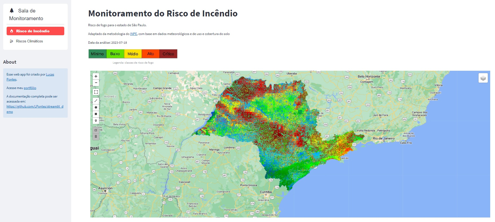

# Estudo de caso sobre monitoramento de riscos climáticos e de incêndio florestal

O Risco de Fogo foi calculado para o estado de São Paulo usando uma adaptação da metodologia do [INPE](https://queimadas.dgi.inpe.br/~rqueimadas/documentos/RiscoFogo_Sucinto.pdf).

Foram utilizados dados de sensoreamento remoto disponíveis no catálogo do Google Earth Engine.

- Para os dados de precipitação foi utilizado o [IMERG](https://developers.google.com/earth-engine/datasets/catalog/NASA_GPM_L3_IMERG_V06).
- A temperatura e umidade relativa vieram do modelo [GFS](https://developers.google.com/earth-engine/datasets/catalog/NOAA_GFS0P25).
- Os dados de focos de incêndio foram obtidos dos sensores [VIIRS](https://developers.google.com/earth-engine/datasets/catalog/NOAA_VIIRS_001_VNP14A1#description).
- A altitude utilizada foi a do [SRTM](https://developers.google.com/earth-engine/datasets/catalog/CGIAR_SRTM90_V4)
- O mapa de uso e ocupação do uso do solo utilizado foi a coleção 7.1 do [Mapbiomas](https://mapbiomas.org/colecoes-mapbiomas-1?cama_set_language=pt-BR)

Os calculos podem ser acessados na pasta src.

O aplicativo web foi desenvolvido com o Streamlit.

App URL: <https://monitoramento-fogo-e-clima.streamlit.app/>

 

